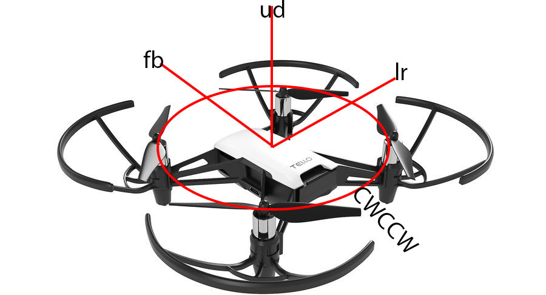
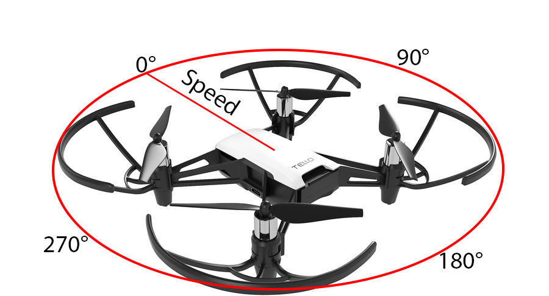

#  WinTello Insctructions
as the name indicates this library can only be used on Windows systems. It is not compatible with other operating systems, because the socket management varies between other OS-s and Windows systems.

## How to Use
### Functions:

#### remoteControll
##### Return Value:
-
##### Parameters:
			-fb: forward backward velocity(-100 - 100)
			-lr: left right velocity(-100 - 100)
			-ud: up down velocity(-100 - 100)
			-cwccw: turning velocity(-100 - 100)

##### Description:
Controlls the drone as it had a controller with 4 axes  
**NOTE:** The Drone does **NOT** stop moving until a new message get sent!

#### remoteControllEasy
##### Return Value:
-
##### Parameters:
				-alpha: direction of the manouver
				-speed: speed of the drone from 1 to 100

##### Description:
 Easy controll for the drone  
 **NOTE:** The Drone does **NOT** stop moving until a new message get sent!

#### ascend
##### Return Value:
-
##### Parameters:
			-distance: how many cm should the drone ascend (20-500)

#### descend
##### Return Value:
-
##### Parameters:
			-distance: how many cm should the drone descend (20-500)

#### connect
##### Return Value:
-
##### Parameters:
			-Bitrate: set the bitrate of the video stream (1=1Mbps/2=2Mbps/3=3Mbps/4=4Mbps/5=5Mbps/0=Auto
			-VideoRes desidec what the resolution should be(480p=low/720p=high)
##### Description: 
connects to the drone only after the wlan is already connected

#### takeoff
##### Return Value:
-
##### Parameters:
-
##### Description:
Initiates Takeoff and hovers at a 50cm height

#### land
##### Return Value:
-
##### Parameters:
-
##### Description:
Lands the drone

#### startVideoStream
##### Return Value:
-
##### Parameters:
-
##### Description:
starts the udp server on the drone

### More methods can be found and are decribed in the WinTello.h file

### Examples:
A Few Examples can be found under the examples folder
